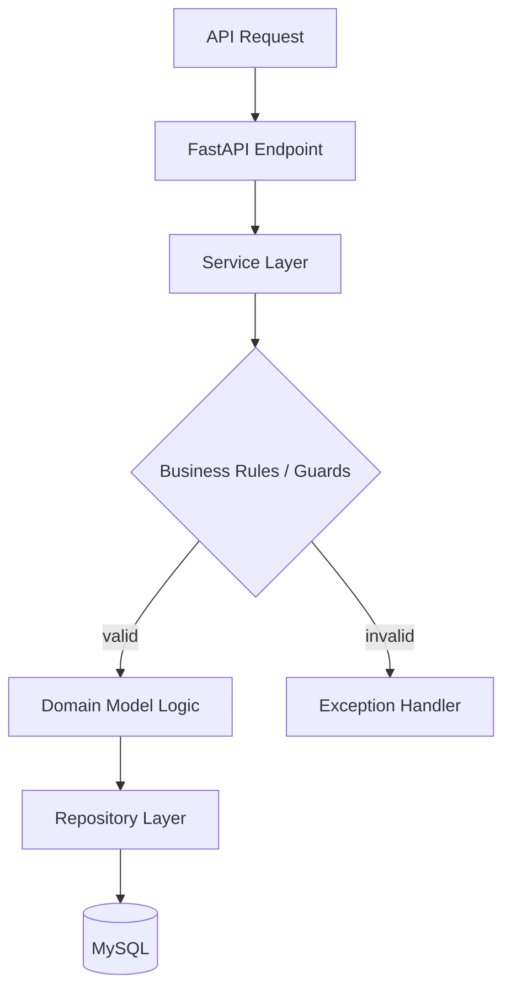

# Mini SaaS Backend (Subscriptions & Billing API)

A lightweight backend system for managing users, subscriptions, and invoices.

Designed to demonstrate **clean layered architecture** and explicit business logic separation.

---

## Tech Stack

Python · FastAPI · MySQL · JWT · bcrypt · Pydantic

---

##  Features

- user registration and JWT authentication 
- subscription lifecycle management [create/update/cancel] 
- subscription plans
- subscription durations
- invoice generation on subscription activation
- subscription and invoice status tracking
- access control based on active subscription state

---

## Architecture

API → Service Layer → Repository → MySQL

- **Service Layer** – business rules, guards, workflow logic
- **Repository Layer** – pure database access (SQL only)
- **Domain Models** – entity behavior (`is_active`, state transitions)

Focus: strict separation of concerns and business logic isolation.

---

## System Flow

Request flow including business validation and domain decision points:

## Key Design Decisions
- business logic isolated from HTTP and SQL layers
- explicit guards for subscription state transitions
- domain models responsible for state validation
- service layer acts as workflow orchestrator
- single active subscription enforced per user

## Notes
- The system assumes a single active subscription per user at a time
- Invoice lifecycle is tied to subscription state changes
- Database layer is intentionally kept thin to avoid leaking business rules into SQL